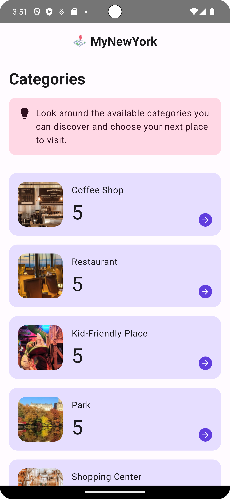
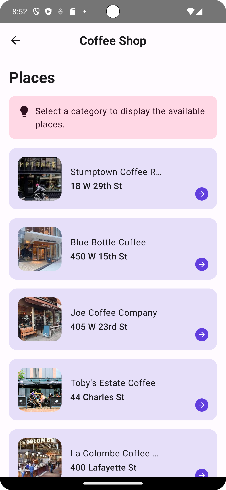
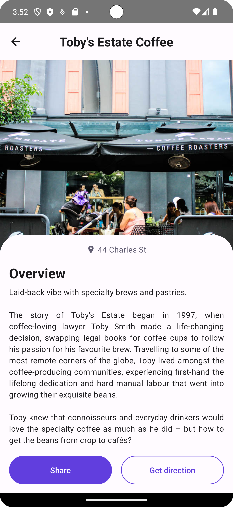
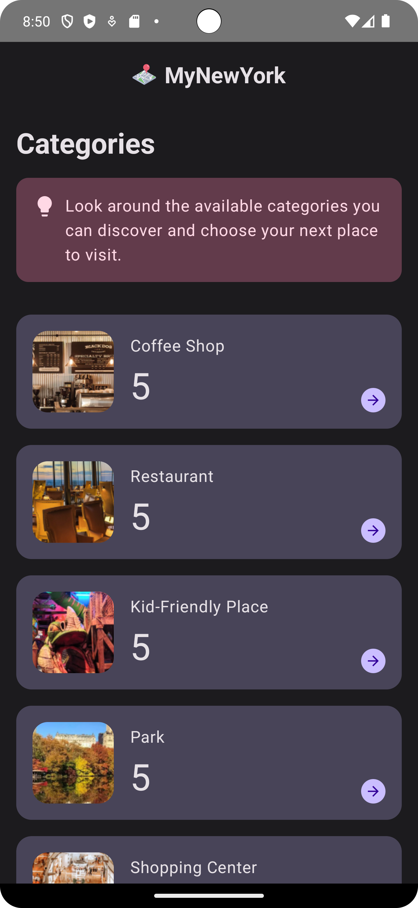
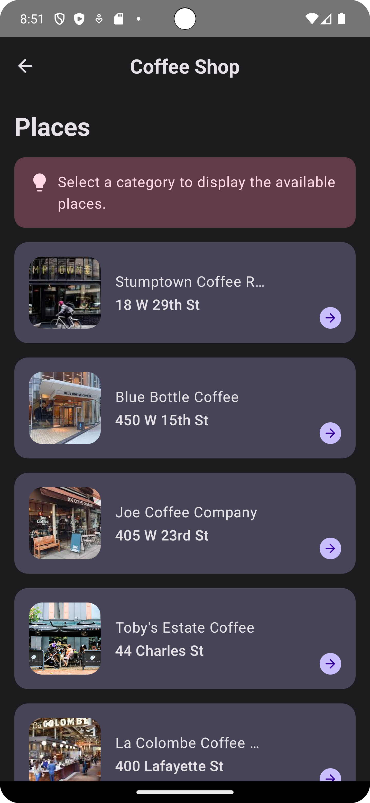
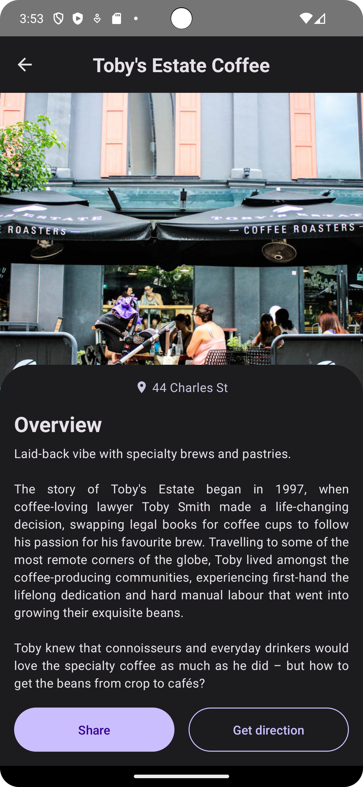
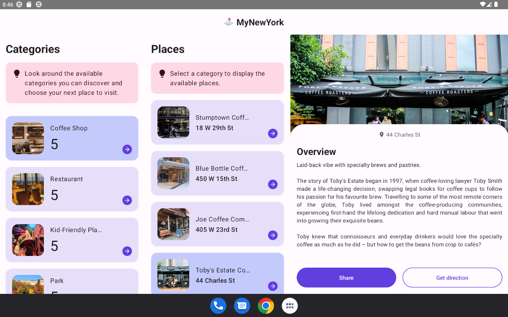
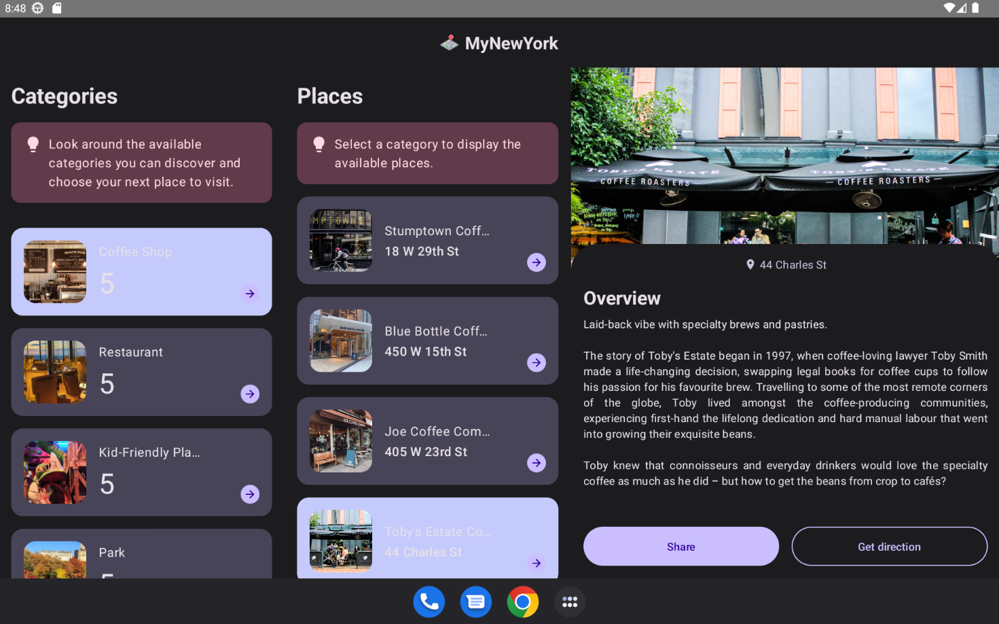

MyNewYork App
==================================

MyNewYork app provides some lists of recommendations for different activities and places to visit within New York city.

It's developed using Jetpack Compose components like ```Column```, ```Button```, ```Text```, ```Image```, and ```Modifier```.

<p align="center">
  
  
  
</p>

<p align="center">
  
  
  
</p>

<p align="center">
  
</p>

<p align="center">
  
</p>

Getting Started
---------------

1. Install Android Studio, if you don't already have it.
2. Download the sample.
3. Import the sample into Android Studio.
4. Build and run the sample.